# HOME — Mansion & Family

A first-person game set in your own mountain-view mega mansion, with Kaelie,
James and Chloie living in it alongside you. It runs in the browser, needs no
build step and no downloads — every wall, every piece of furniture, every
texture and every sound is generated in code when the page loads.

## Just play it

**Download [`play.html`](play.html) and double-click it.** That one file is the
whole game — every module, all of three.js and the stylesheet are inlined, so it
runs straight off your disk with no server, no install and no network at all.

Or run the multi-file version from any static server:

```bash
python3 -m http.server 8080     # then open http://localhost:8080
```

Chrome, Edge, Firefox or Safari with WebGL2. Click **Enter the House**, then
click once more to capture the mouse.

<sub>`play.html` is generated — edit the sources under `src/` and regenerate with
`npm i --no-save esbuild@0.28.2 && node tools/build-single-file.mjs`.</sub>

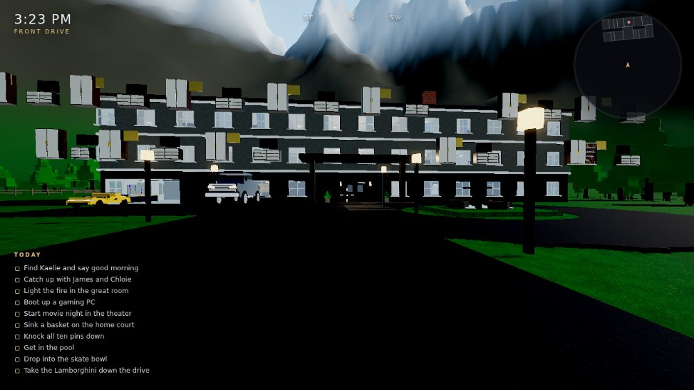

| | |
| --- | --- |
| 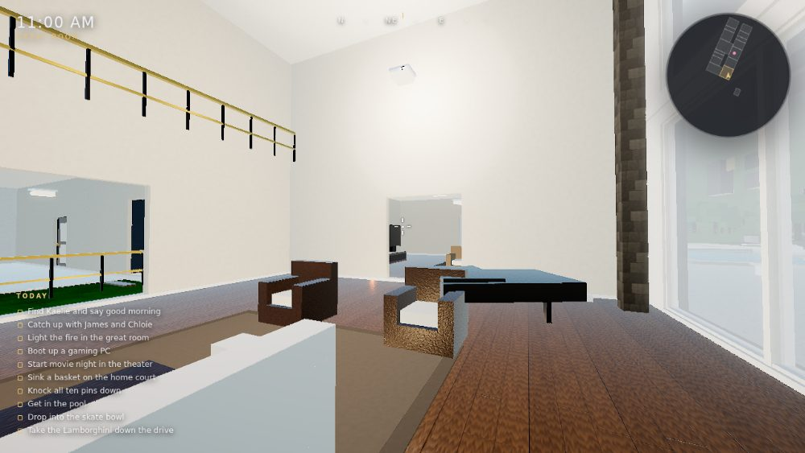 | 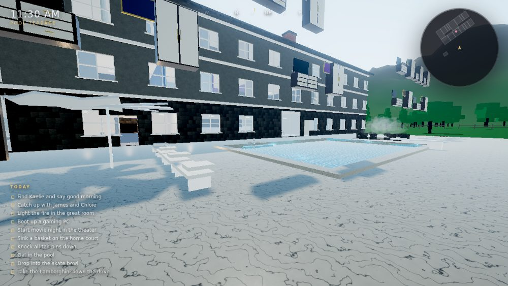 |
| 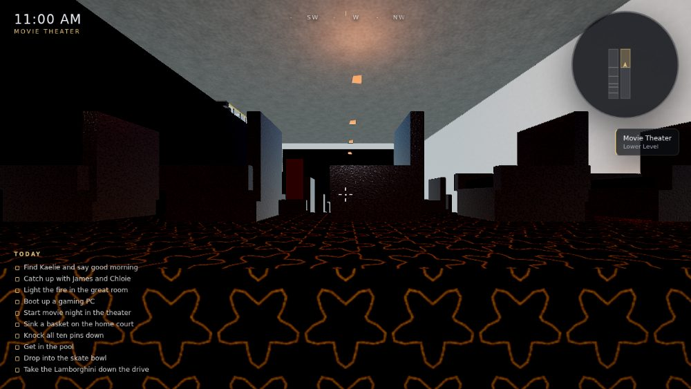 | 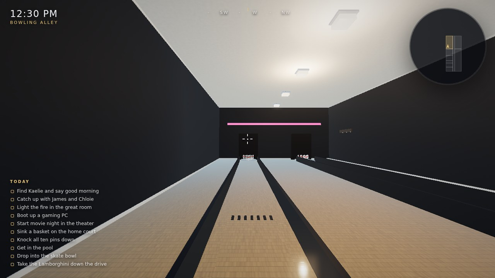 |
| 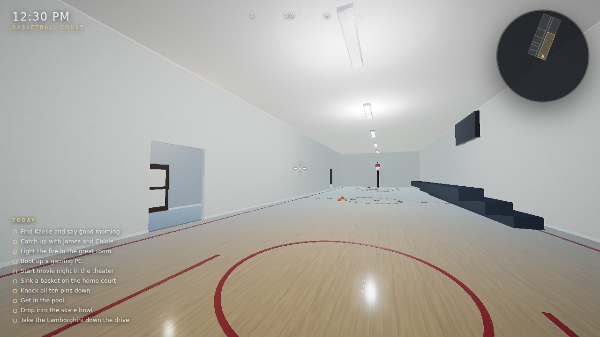 | 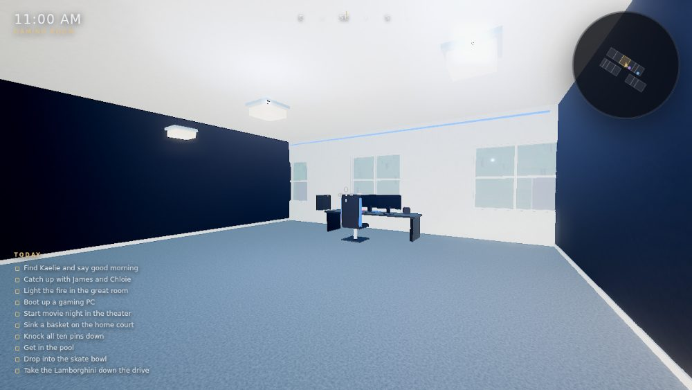 |
| 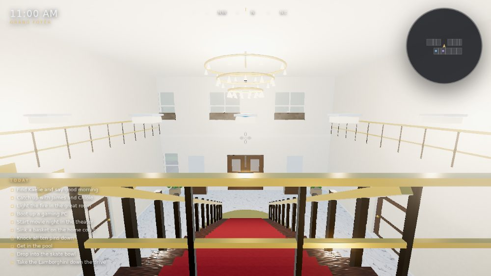 | 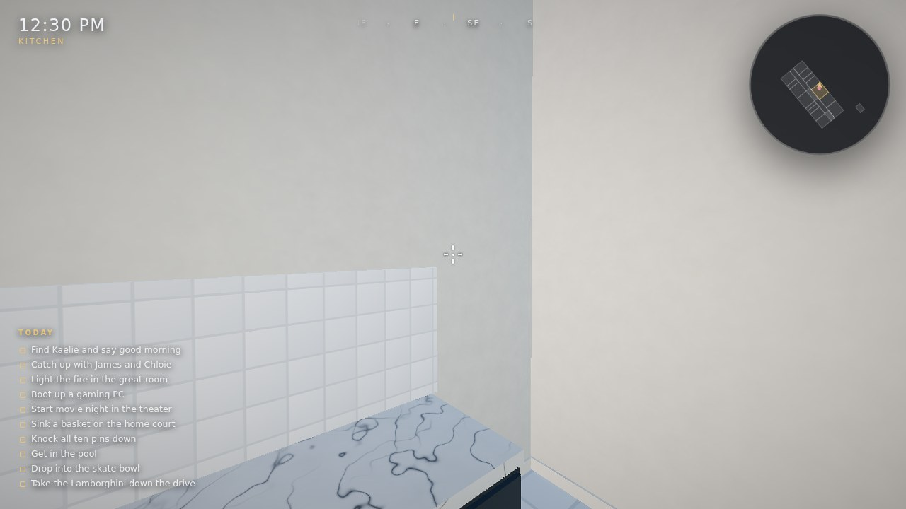 |
| 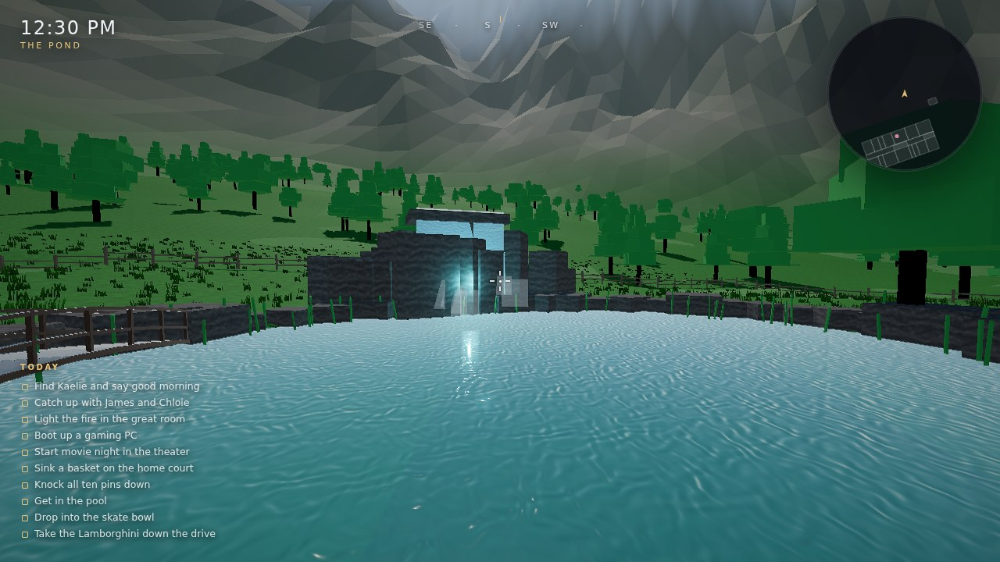 | 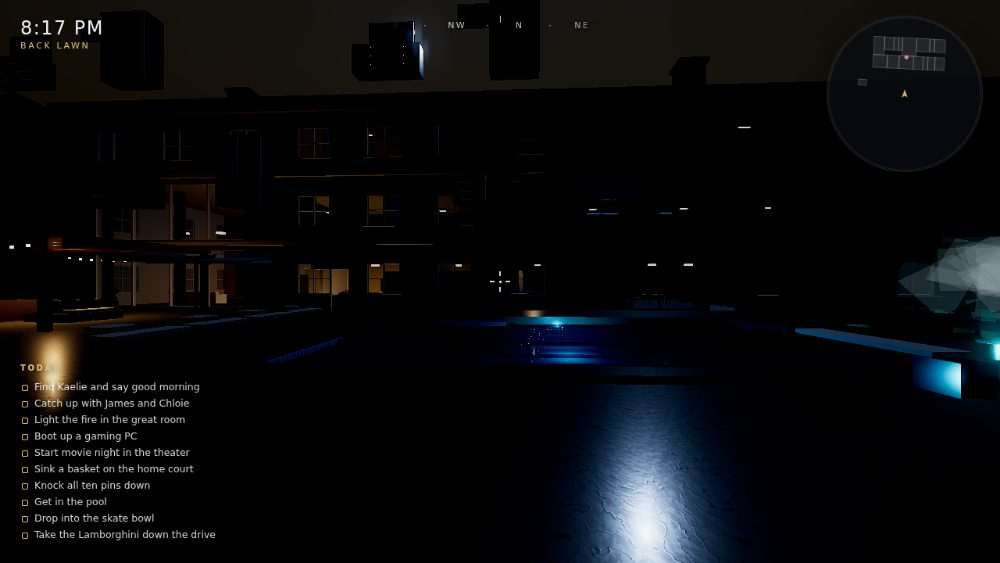 |

*(All rendered in a headless browser on a software rasteriser — a real GPU is
sharper and runs the lighting at full rate.)*

---

## The house

**Four levels, 22 bedrooms, 9 bathrooms**, 60 m × 26 m under a gabled roof with
three stone chimneys.

| Level | What's on it |
| --- | --- |
| **Lower level** | Movie theater with a 3.6 m screen, tiered recliners and a projector beam · two-lane bowling alley with real pins · full basketball court with glass backboards and bleachers · gym · laundry & utility · workshop · storage · bathroom |
| **Main floor** | Double-height great room with a stone fireplace and a glass wall onto the terrace · second family room with its own fireplace · chef's kitchen with island and pendants · dining hall · library & study · grand foyer with chandelier and a 24-step staircase · powder room · mud room · butler's pantry · three-car garage · laundry · sunroom |
| **Second floor** | Master suite with ensuite bath · James's room · Chloie's room · Jack & Jill bath · gaming room · six more bedrooms · gallery overlooking the great room and foyer |
| **Third floor** | Thirteen bedrooms including a bunk room, a loft gaming room and three baths |

## The grounds

Marble terrace, **swimming pool** (sloping floor, steps, diving board,
underwater lights) with an eight-sided **hot tub** that steams in the cold.
Pergola with string lights, sun loungers, a stone-edged **pond** fed by a
**running waterfall** off a rock ledge, a plank bridge and stepping stones. A
covered **picnic area** with tables, a grill and a fire pit you can light. A
concrete **skate park** with a real dished bowl, two quarter pipes, a funbox,
rails and a kicker under floodlights. A **shed** with a ride-on mower, tools,
fuel cans and a wheelbarrow. Out front, a lamp-lit driveway, a fountain
turnaround and two vehicles you can actually drive.

## The family

**Kaelie**, **James** and **Chloie** each follow their own hourly schedule and
walk the house on a navigation graph — up and down the stairs, out to the pool,
into the gaming room. Walk up and press **E** to talk, ask what they're up to,
or give them a hug. Their positions show on the minimap in their own colours.

### Doing things together

Talking to any of them offers **"Do something together…"**, and what's on the
list depends on who you asked and what time it is. They'll break off whatever
they were doing, walk there and meet you:

| | |
| --- | --- |
| **Go for a drive** | They get in the passenger seat and ride along while you drive |
| **Go bowling** | Down to the alley for a couple of games |
| **Watch a film** | Both of you in the theater — start the projector |
| **Go for a swim** | Daylight hours, out to the pool |
| **Sit in the hot tub** | Kaelie, after four in the afternoon |
| **Hang out at the picnic area** | Sit outside together while it's light |
| **Cook something together** | In the kitchen — it ends with dinner on the table |
| **Shoot some hoops** | First to five on the home court |
| **Look for frogs** | Chloie, down at the pond |
| **Help with homework** | After school, at their own desk |
| **Come to the skate park** | James, showing you what he's got |

### Being a parent

The kids can be told **that's enough screens for today** — the console goes
away until tomorrow, they sulk about it, and they stop drifting to the gaming
room. Give it back whenever you like. You can also tell them you're proud of
them, which lands rather better.

### Birthdays

Everyone has one, on their own day of the month. When it comes round you'll be
told at midnight; find them, wish them happy birthday, and the dining hall gets
bunting, balloons, a banner and a cake with candles while the whole family sits
down together.

The journal (**Tab**) tracks the day, whose birthday is coming, what each of
them is doing right now, and how close you've got to each of them.

## Things to do

Ten objectives track down the left of the screen: greet Kaelie, catch up with
the kids, light the great-room fire, boot a gaming PC, start movie night, sink
a basket, knock down all ten pins, get in the pool, drop into the skate bowl,
and take the Lamborghini down the drive. Progress and the room you discovered
last are saved, so closing the tab doesn't cost you anything.

**The skateboard rides.** Pick it up at the park, press **F**, and you're on it:
push with **W**, drag a foot with **S**, ollie with **Space**. It keeps its
momentum, so the bowl's transitions trade height for speed the way they should.

---

## Controls

| | |
| --- | --- |
| **W A S D** | Move |
| **Shift** | Sprint |
| **Space** | Jump — at a ledge you'll pull yourself up · swim up · brake in a vehicle |
| **C / Ctrl** | Crouch · swim down |
| **E** | Interact — open doors, sit, pick things up, talk, switch things on |
| **Left mouse** | Throw what you're holding |
| **Right mouse** | Zoom |
| **G** | Drop |
| **F** | Get in / out of a vehicle · step on and off the skateboard |
| **L** | Flashlight |
| **Tab** | Journal |
| **H** | Hide the HUD (photo mode) |
| **P** | Save a screenshot |
| **Mouse wheel** | Scrub the time of day |
| **Esc** | Pause and settings |

Gamepads work too — left stick moves, right stick looks. On a phone or tablet
the game switches to touch: a stick bottom-left, drag the right of the screen to
look, and jump / use / run buttons.

---

## How it is built

No engine, no asset pipeline, no dependencies beyond a vendored copy of
[three.js](https://threejs.org) (r169, MIT) in `vendor/`.

```
play.html             the whole game as one self-contained file (generated)
tools/build-single-file.mjs   how play.html is produced
index.html            import map + all the DOM for the UI
styles/ui.css         menus, HUD, dialogue, minimap
src/
  main.js             entry point and frame loop
  game.js             builds the world, owns the glue between systems
  core/
    engine.js         renderer, ACES tone mapping, bloom, grade/sharpen, SMAA
    materials.js      the material library
    textures.js       procedural canvas textures + derived normal/roughness maps
    input.js          keyboard, mouse look, gamepad, persisted settings
    rng.js            seeded noise and easing helpers
  world/
    atmosphere.js     stars, the moon and the drifting cloud layer
    vegetation.js     instanced, wind-swayed grass in one draw call
    plan.js           the floor plan: every room as a rectangle
    mansion.js        slabs, walls, doors, windows, stairs, roof
    build.js          the construction kit — batching, world-space UVs, openings
    furniture.js      beds, sofas, kitchens, baths, fireplaces, TVs…
    amenities.js      theater, bowling, court, gym, gaming rooms, garage
    furnish.js        walks the room list and fills each one in
    terrain.js        lawn, mountains, trees, sky and the day/night cycle
    backyard.js       terrace, pool, hot tub, pond, waterfall, skate park, shed
    vehicles.js       the truck, the Lamborghini and the driving model
    nav.js            navigation graph + Dijkstra for the family
    world.js          the registry everything writes into
  systems/
    player.js         capsule physics, stairs, crouch, swimming, sitting
    props.js          grabbable, throwable, bouncing objects
    interaction.js    what you're looking at and what E does to it
    lights.js         200 declared lights, 10 real ones
    screenfx.js       animated canvas content for every screen in the house
    audio.js          procedural WebAudio — footsteps, water, fire, engines
  entities/
    character.js      jointed procedural humans with a walk cycle
    family.js         Kaelie, James, Chloie: schedules, routes, dialogue
  ui/ui.js            menus, HUD, minimap, journal, settings
```

A few things worth knowing:

- **Everything static is merged.** The mansion is authored as tens of thousands
  of boxes and then batched per material, so the whole thing draws in a few
  dozen calls.
- **UVs are projected in world space**, so a 12 m wall and a 0.4 m drawer front
  get the same texel density with one shared material.
- **Collision** is a separate simplified box mesh fed into a three.js `Octree`;
  the player is a `Capsule`, props are spheres, and doors and cars are dynamic
  rotated boxes tested separately.
- **Lighting** is deliberately low on sky fill — the house is lit by its own
  fixtures, and only the ten nearest of the ~220 declared lights are ever real
  GPU lights.
- **No image files.** Wood, marble, stone, carpet, tile, grass and the rest are
  drawn into 2D canvases, and their normal and roughness maps are derived from
  a height field with a Sobel pass.

## Settings

Esc or the main menu: field of view, sensitivity, invert look, head bob,
detail, shadows, bloom, **image sharpness**, render scale, **grass density**,
volume, time-of-day speed and a performance readout — plus buttons to reset the
settings or wipe your progress. Everything persists in `localStorage`.

If the frame rate is low, drop **Render scale** to 0.75 and set **Shadows** to
Soft — that recovers most of the cost. Render scale above 100% supersamples,
which is the cheapest way to a crisper image if you have the headroom.
